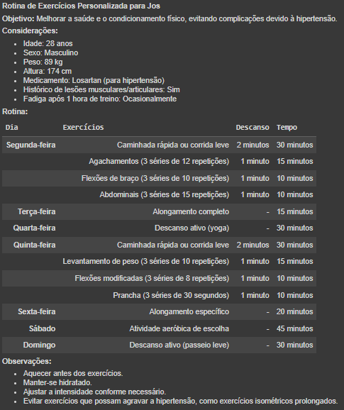
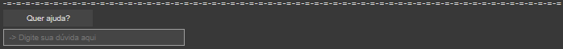

### **Apresentação**
Este código implementa um chatbot chamado "NutriTrain" que atua como um instrutor pessoal de exercícios e nutrição. As imagens mostram o fluxo de interação com o usuário.

### Objetivo do Código:
O código visa oferecer um guia personalizado para saúde e bem-estar, combinando exercícios e nutrição. Ele personaliza planos alimentares e rotinas de exercícios, além de oferecer suporte contínuo para ajudar o usuário a alcançar seus objetivos.

### **Funcionalidades:**

### **Tela de Boas-Vindas:**
O NutriTrain é introduzido como um instrutor pessoal dedicado a ajudar os usuários a atingir seus objetivos de saúde de maneira eficaz e sustentável. Ele informa sobre a realização de um teste para personalizar o programa, estabelecendo uma atmosfera acolhedora desde o início.

    <h2></h2>
    
    

### **Rotina de Exercícios:**
A mensagem "Atenção: seja sincero ao responder as perguntas" destaca a importância da precisão dos dados para a personalização do programa. A interação guiada visa coletar informações relevantes para adaptar os exercícios de acordo com as necessidades e capacidades individuais.

    <h2></h2>
    
    

### **Plano Nutricional Personalizado:**
O NutriTrain gera um plano nutricional personalizado com base nas informações fornecidas pelo usuário. Este plano inclui objetivos específicos, recomendações de alimentos, sugestões para evitar certos alimentos e dicas práticas para a gestão da alimentação diária.

    <h2></h2>
    
    

### **Suporte Contínuo:**
Além de oferecer orientações personalizadas, o NutriTrain disponibiliza suporte contínuo, permitindo que os usuários tirem dúvidas e recebam assistência adicional ao longo do programa. Isso promove um ambiente de apoio e encorajamento durante toda a jornada de saúde e condicionamento físico.

    <h2></h2>
    
    

### **Benefícios do Código:**

**- Personalização:** Adaptação às necessidades individuais de cada usuário, garantindo que os planos de exercícios e nutrição sejam eficazes e seguros.

**- Orientação Integral:** Combinação de exercícios físicos e nutrição para abordar de forma abrangente os objetivos de saúde e bem-estar.

**- Facilidade de Uso:** Interface interativa e amigável, permitindo uma experiência de usuário intuitiva e satisfatória.
